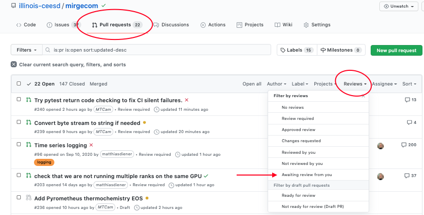

Working with Pull Requests
==========================

We are using GitHub's pull requests (PRs) feature to integrate changes into
mirgecom and its supporting packages. Pull requests are based on git branches
that are merged into another branch (usually the ``main`` branch). Note that
pull requests are a GitHub feature and live outside the main git
functionality; the ``git`` program itself has no knowledge of them.

.. note::

   A good overview of basic git functionality and the ``git`` program can be found
   on this `GitHub page <https://try.github.io/>`__.

.. note::

   On most systems, the ``git`` program will already be installed. You can
   install it yourself by running ``conda install git``.

Forking the repository
----------------------

In most cases, it will be necessary to fork the repository (that is, create a
copy of the repository in your own GitHub account), since creating a pull
request requires creating a branch in the repo, which requires write access.
You can fork a repository directly on the GitHub website. You can add the URL of
the fork to your local cloned copy of the repository with the following command:

.. code:: bash

   $ git remote add my_fork git@github.com:MYUSERNAME/REPONAME

Creating a new pull request
---------------------------

1. Create a new branch for your pull request:

   .. code:: bash

      $ cd mirgecom           # or loopy, meshmode, ...
      $ git switch -c featureX   # Create new branch for your feature and switch to it
      # Edit files

2. Check that your changes pass tests:

   .. code:: bash

      # Install these with 'pip install wheel flake8 pep8-naming flake8-quotes pytest pylint' if needed
      # (emirge will have installed them for you automatically)
      $ flake8 mirgecom test
      $ pydocstyle mirgecom test
      $ (cd test && python -m pytest)

3. Commit your changes to the new branch:

   .. code:: bash

      $ git add file1.py file2.py
      $ git commit

4. Push your changes:

   .. code:: bash

      $ git push -u my_fork featureX

5. Create pull request:

   https://github.com/illinois-ceesd/mirgecom/pulls

   The ``base`` branch should be the ``main`` branch of the repo you want to
   merge into in most cases. The ``compare`` branch is the branch with your
   changes.

6. After the pull request has been merged, please delete the branch
   (locally and remotely):

   .. code:: bash

      $ git branch -d featureX    # delete branch locally
      $ git push –delete featureX # delete it remotely; or delete in web interface

Updating a pull request
-----------------------

Commit to the same local branch and push that branch:

.. code:: bash

   $ git commit
   $ git push

When changing the history of a branch (e.g., by rebasing the branch, or
by amending a commit that is already pushed), you might need to
force-push it back to the repository (i.e, ``git push --force``). Please
use this sparingly.

Dependent pull requests
-----------------------

It is likely that you will need to propose changes to supporting packages
(e.g. grudge, meshmode, loopy, pyopencl) in order to implement a feature in
mirgecom, thus creating a mirgecom PR that depends on a PR in the other package.
In a situation where both PRs are under review at the same time, mirgecom has a way
to express this dependency to make it easier to review and test both PRs jointly.

You can express this dependency by modifying the branch of a dependent package
inside mirgecom's ``requirements.txt`` file in the main mirgecom folder. In
the following example, assume that we want to create a feature in mirgecom
that depends on the ``featureX`` branch in meshmode::

   git+https://github.com/inducer/meshmode.git#egg=meshmode
   # change to:
   git+https://github.com/MYUSERNAME/meshmode.git@featureX#egg=meshmode

With this change, new emirge installations and continuous integration tests will
automatically use the ``featureX`` branch of meshmode.

.. important::

   You will need to merge the dependent PR first (ie., meshmode in the above
   example), then restore the original ``requirements.txt`` of mirgecom, and
   then merge the mirgecom PR.

Reviewing & PRs
---------------

Each pull request for mirgecom needs one manual approval by a reviewer and
needs to pass the Continuous Integration (CI) tests before merging. For the
manual reviews, please select at least one reviewer (someone that has
knowledge about the code you are modifying) in the "Reviewers" box at the top
right of a PR. You can set the PR as a "draft" PR to indicate that it is still
in progress and only a high-level review is requested.

.. note::

   Some thoughts and best practices regarding submitting your code for review can be found in this
   article:

   - `How to Make Your Code Reviewer Fall in Love with You <https://mtlynch.io/code-review-love/>`__

   A similar (but mirrored) set of concerns applies from the other direction. You will definitely
   want to read these articles when you start reviewing other folks' code, but it may be
   helpful to read them even before then to gain a better understanding of the process:

   - `How to Do Code Reviews Like a Human (Part One) <https://mtlynch.io/human-code-reviews-1/>`__
   - `How to Do Code Reviews Like a Human (Part Two) <https://mtlynch.io/human-code-reviews-2/>`__

Arguably one of the most important considerations for creating, maintaining and
reviewing PRs is the *size of the PR*. In general, developers should strive to
keep them small. Try to break large feature developments into smaller, more
manageable pieces.  Small PRs are far easier to understand, review, and identify
potential defects.  Your feature(s) will merge much faster and cleaner if the
PRs are kept small.

We often use inter-developer peer review for PRs. Flag your peers as reviewers
for your work.  More eyes on our developments result in higher quality, more robust
software. As a part of the development team, it is important for you to keep up with
your PRs, and the PRs of your peers who have requested your attention.  The Github
web interface can let you know when someone has requested your review.

Continuous Integration Testing (CI)
-----------------------------------

We use GitHub actions as the CI provider to test each pull request. The CI
tests are triggered automatically when a pull request is created or updated.
The CI tests comprise style-related tests to see if the PR conforms to our
coding guidelines (using the ``flake8``, ``pylint``, and ``pydocstyle``
packages), as well as functional tests using the ``pytest`` package. When a
test fails, please take a look at the CI outputs to fix the error. Both draft
PRs and full PRs will undergo CI tests.

To check the code automatically on your local machine before creating the git
commit, you can use a git hook such as the following one (save this script as
``.git/hooks/pre-commit`` in the mirgecom/ folder and make it executable):

.. code-block:: bash

   #!/bin/bash

   if [[ $(command -v "flake8") ]]; then
       flake8 mirgecom/ test/ examples/ setup.py doc/conf.py
       res=$?
       if [[ $res -ne 0 ]]; then
           echo "Error: flake8 check failed. Fix the errors (or run git with --no-verify to bypass the check)."
           exit $res
       fi
   else
       echo "Warning: flake8 not found. Run 'pip install flake8' to install it."
   fi

   if [[ $(command -v "pydocstyle") ]]; then
       pydocstyle mirgecom/
       res=$?
       if [[ $res -ne 0 ]]; then
           echo "Error: pydocstyle check failed. Fix the errors (or run git with --no-verify to bypass the check)."
           exit $res
       fi
   else
       echo "Warning: pydocstyle not found. Run 'pip install pydocstyle' to install it."
   fi

While highly recommended, hooks can sometimes be annoying. After setting up your hooks, you can use ``git --no-verify`` or equivalently ``git -n`` to run ``git`` commands without triggering the hooks.

Merging a pull request
----------------------

There are three ways of merging a pull request in the web interface: **squash
and merge**, **rebase and merge**, and **create a merge commit**.

Squash and merge
^^^^^^^^^^^^^^^^

Squash all commits into one commit and merge it to the ``main`` branch. This is
the preferred option, especially for small changes, as it keeps the history
shorter and cleaner, makes git bisection easier, and makes it easier to revert
a pull request.

Rebase and merge
^^^^^^^^^^^^^^^^

Rebase all commits to top of the ``main`` branch and merge all commits. This
is the preferred option for larger changes, for example, by having
separate commits for the implementation of a feature and its
documentation

Other possibilities (such as squashing only some commits and then
merging multiple commits into ``main``) are not directly supported by
GitHub’s Web UI, but can be done manually on the command line (these
might need to be force pushed to a branch).

Create a merge commit
^^^^^^^^^^^^^^^^^^^^^

This options just merges all commits into the ``main`` branch. This is the simplest
way to merge a pull request, but can lead to issues with bisection and reverting PRs
later.

Tools
-----

Apart from the ``git`` tool, there are other tools that help to simplify various
aspects of working with GitHub:

Command line
^^^^^^^^^^^^

- `GitHub's "hub" client <https://hub.github.com/>`__
- `GitHub's "cli" client <https://github.com/cli/cli>`__

GUI
^^^

- `Fork <https://git-fork.com/>`__ (Mac, Windows)
- `GitHub Desktop <https://desktop.github.com/>`__ (Mac, Windows)
- `Sublime Merge <https://www.sublimemerge.com/>`__ (Linux, Mac, Windows)
- `Magit <https://magit.vc>`__ (Emacs)
