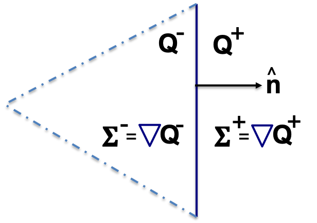

=======================
Discretization Strategy
=======================

.. _disc-strat:

.. raw:: latex

    \let\b=\mathbf

.. raw:: html

    \(
    \let\b=\mathbf
    \)

Literature on DG for Fluid Flow
===============================

How to discretize the conservation equations with DG, including how to handle the required
fluxes, particularly in the viscous setting, is a current topic of research and internal
discussion.  The following references are useful:

* "The DG Book:" Nodal Discontinuous Galerkin Methods, [Hesthaven_2008]_
* The BR1 method for discretization of Navier-Stokes, [Bassi_1997]_
* NS with reactions, [Ihme_2014]_, and [Cook_2009]_
* The BR2 method, [Bassi_2000]_
* [Ayuso_2009]_
* Shock handling [Woodward_1984]_
* Artificial viscosity [Persson_2012]_

*MIRGE-Com* currently employs a strategy akin to the BR1 algorithm outlined in
[Bassi_1997]_, but with thermal terms and chemical reaction sources as outlined in
[Ihme_2014]_ and [Cook_2009]_.

Nodal DG for Navier-Stokes
==========================

The main system of equations we solve in the BR1 approach is summarized as follows:

The compressible NS equations are rewritten as the following coupled system for two
unknowns, $\b{Q}$ and $\b{\Sigma}$:

$$
\b{\Sigma} - \nabla{\b{Q}} &= \b{0}\quad{\text{auxiliary eqn}}\\
\frac{\partial \b{Q}}{\partial t} + \underbrace{\nabla\cdot\b{F}^I(\b{Q}) -
\nabla\cdot\b{F}^V(\b{Q},\b{\Sigma})}_{= \nabla\cdot\b{F}(\b{Q},
\b{\Sigma})} &= \b{S} \quad{\text{primary eqn}}
$$

Let $\Omega_h$ denote a collection of disjoint elements $E$. The DG method constructs
approximations $\b{Q}_h$ and $\b{\Sigma}_h$ to $\b{Q}$ and $\b{\Sigma}$,
respectively, in discontinuous finite element spaces. For any integer $k$, we define
the following discontinuous spaces of piecewise (vector-valued) polynomial functions:
$$
\b{V}^k_h &= \left\lbrace \b{v} \in L^2(\Omega_h)^N:
\b{v}|_E \in \lbrack P^k(E) \rbrack^N, \text{ for all } E \in \Omega_h
\right\rbrace, \\
\b{W}^k_h &= \left\lbrace \b{w} \in L^2(\Omega_h)^{N\times d}:
\b{w}|_E \in \lbrack P^k(E) \rbrack^{N\times d}, \text{ for all } E \in \Omega_h
\right\rbrace,
$$
where $N = d + 2 + N_s$, $d$ is the spatial dimension, and $N_s$ is the total number of
mixture species. Here, $P^k(E)$ denotes a polynomial space on $E$ consisting of functions
of degree $\leq k$. The DG formulation is obtained by multiplying by ''test functions''
$\b{v}_h \in \b{V}^k_h$, $\b{w}_h \in \b{W}^k_h$
(one for each equation repsectively) and integrating over each element.
The resulting DG problem reads as follows. Find $(\b{Q}_h,
\b{\Sigma}_h) \in \b{V}^k_h \times \b{W}^k_h$ such that, for all
$(\b{v}_h, \b{w}_h) \in \b{V}^k_h \times \b{W}^k_h$, we have:

$$
\sum_{E\in\Omega_h} \left\lbrack \int_E \b{v}_h\cdot\frac{\partial \b{Q}_h}
{\partial t} d\Omega + \oint_{\partial E} \b{v}_h\b{h} d\sigma - \int_E \nabla
\b{v}_h\cdot\b{F}(\b{Q}_h, \b{\Sigma}_h)d\Omega\right\rbrack &=
\sum_{E\in\Omega_h} \int_E \b{v}_h\cdot\b{S}_h d\Omega, \\
\sum_{E\in\Omega_h}\left\lbrack \int_E \b{w}_h\cdot \b{\Sigma}_h d\Omega -
\oint_{\partial E} \b{w}_h\cdot\b{H}_s d\sigma + \int_E \nabla\b{w}_h\cdot
\b{Q}_h d\Omega\right\rbrack &= 0,
$$

where $\b{h} = \b{h}_e - \b{h}_v$ is a *numerical flux* respectively representing
the inviscid and viscous contributions to the physical flux
$\left(\b{F}^I(\b{Q}_h) - \b{F}^V(\b{Q}_h, \nabla\b{Q}_h)\right)\cdot\b{n}$, with
$\b{n}$ being the outward facing unit normal with respect to the local element.
$\b{H}_s$ is the *gradient numerical flux* ($\b{Q}_h\b{n}$) for the auxiliary equation.
Here, we use the subscript "$h$" to denote discretized quantities. See below for more
on these functions.

Since $\b{F}^I(\b{Q}_h)\cdot\b{n}$ is discontinuous, the quantities are
allowed to vary on either side of a shared element boundary. That is, $\b{F}^I
(\b{Q}^+_h)\cdot\b{n}^+ \neq \b{F}^I(\b{Q}^-_h)\cdot\b{n}^-$.
Here, $\b{n}^+$ and $\b{n}^-$ denote the ''cell-local'' (outward pointing) unit normals
for elements $E^+$ and $E^-$ (respectively) which share a face:
$\partial E^+ \cap \partial E^- \neq \emptyset$.
Similarly for $\b{F}^V(\b{Q}_h, \b{\Sigma}_h)\cdot\b{n}$ and
$\b{Q}_h\b{n}$.

Expanding out the trial and test functions (component-wise) in terms of the local
element basis in each element:
$$
\b{Q}(\b{x}, t)_h|_E = \sum_{i=1}^n \b{Q}_i(t)\phi_i^k(\b{x}), \quad
\b{\Sigma}(\b{x})_h|_E = \sum_{i=1}^n \b{\Sigma}_i\phi_i^k(\b{x}), \\
\b{v}(\b{x})_h|_E = \sum_{i=1}^n \b{v}_i\phi_i^k(\b{x}), \quad
\b{w}(\b{x})_h|_E = \sum_{i=1}^n \b{w}_i\phi_i^k(\b{x}),
$$
allows us to obtain a set of algebraic equations for the conserved state $\b{Q}_h$ and
the auxiliary gradient variable $\b{\Sigma}_h$. That is, for each
$j = 1, \dots, \dim P^k$, we have:
$$
\frac{d}{dt} \sum_{E\in\Omega_h}\int_E \phi_j^k\b{Q}_h d\Omega &= \sum_{E\in\Omega_h}
\left\lbrack\int_E \nabla\phi_j^k\cdot\left(\b{F}^V(\b{Q}_h, \b{\Sigma}_h) -
\b{F}^I(\b{Q}_h)\right)d\Omega\right\rbrack \\
&- \sum_{E\in\Omega_h}\left\lbrack\oint_{\partial E}\phi_j^k \b{h}_e(\b{Q}_h^+,
\b{Q}^-_h; \b{n}) d\sigma + \oint_{\partial E} \phi_j^k \b{h}_v(\b{Q}_h^+,
\b{\Sigma}_h^+, \b{Q}_h^-, \b{\Sigma}_h^-; \b{n}) d\sigma\right\rbrack \\
&+ \sum_{E\in\Omega_h} \int_E \phi_j^k\b{S}_h d\Omega, \\
\sum_{E\in\Omega_h}\int_E\phi_j^k \b{\Sigma}_h d\Omega &= \sum_{E\in\Omega_h}\left\lbrack
\oint_{\partial{E}}\phi_j^k \b{H}_s(\b{Q}^+_h, \b{Q}_h^-; \b{n}) d\sigma -
\int_E\nabla\phi^k_j\cdot\b{Q}_h d\Omega\right\rbrack.
$$

Numerical fluxes
================

Numerical fluxes are responsible for calculating the fluxes at the DG element boundaries.  
Numerical fluxes must account for the discontinuities at element faces, and calculate
a single valued flux that both elements agree on.  That is, they must be functions
of both $\pm$ states, and must produce a consistent flux.

For a conservation law $\frac{\partial \b{Q}}{\partial t} + \nabla \cdot \b{F}(\b{Q}) = \b{S}$,
the numerical flux $h$ must satisfy the consistency relations

.. math::
   h(\b{Q}, \b{Q}; \b{n}) = \b{F}(\b{Q})\cdot\b{n}~~~~~~
   h(\b{Q}^+,\b{Q}^-;\b{n}) = -h(\b{Q}^-, \b{Q}^+;-\b{n}).

Inviscid numerical flux
-----------------------

Approximate and exact Riemann solvers are typically used for inviscid numerical flux
functions, $h_e(\b{Q}_h^+, \b{Q}^-_h; \b{n})$.  Typical choices include,
but are not limited to:

* Local Lax-Friedrichs or Rusanov (LFR)
* Harten-Lax-van Leer (HLL)
* Roe
* Engquist-Osher

|mirgecom| currently has LFR, and HLL numerical fluxes available from
the :mod:`~mirgecom.inviscid` module.

The LFR numerical flux is implemented by :func:`~mirgecom.inviscid.inviscid_facial_flux_rusanov` as follows:

.. math::
   h_{e}(\b{Q}_h^+, \b{Q}^-_h; \b{n}) = \frac{1}{2}\left[\left(
   \b{F}^{I}(\b{Q}_h^+)+\b{F}^{I}(\b{Q}_h^-)\right) - \lambda\left(\b{Q}_h^+
   - \b{Q}_h^-\right)\b{n}\right] \cdot \b{n},

where $\lambda$ is the characteristic max wave-speed of the fluid. Numerical fluxes
which penalize the ''jump'' of the state $\left(\b{Q}_h^+ - \b{Q}_h^-\right)
\b{n}$ act as an additional source of dissipation, which has a stabilizing effect
on the numerics.

The HLL numerical flux is implemented by :func:`~mirgecom.inviscid.inviscid_facial_flux_hll` as follows:

.. math::
   h_{e}(\b{Q}_h^+, \b{Q}^-_h;\b{n}) =
   \frac{\left(s^+\b{F}^{I}(\b{Q}_h^-)-s^-\b{F}^{I}(\b{Q}_h^+)\right)+s^+s^-(\b{Q}_h^+ - \b{Q}_h^-)\b{n}}
   {\left(s^+ - s^-\right)} \cdot \b{n}

Numerical Fluxes for Viscous Terms
----------------------------------
Typically, the Riemann solvers used for inviscid fluxes are not employed for the viscous fluxes
of compressible Navier-Stokes equations and the auxiliary equation, $\b{h}_v$, and $\b{H}_s$.

The following sections describe the numerical flux functions used for the divergence of the
viscous transport flux and the gradient of the solution in the auxiliary equation.

Viscous numerical flux
^^^^^^^^^^^^^^^^^^^^^^
The numerical flux function for the divergence of the viscous transport flux
of the Navier-Stokes equations, $\b{h}_v$, is implemented in
:func:`~mirgecom.viscous.viscous_facial_flux_central` as follows:

.. math::
   h_v(\b{Q}_h^+, \b{\Sigma}_h^+, \b{Q}_h^-, \b{\Sigma}_h^-;
   \b{n}) = \frac{1}{2}\left(\b{F}^V_+ + \b{F}^V_-\right) \cdot \b{n},

where $\b{F}^V_{\pm} \equiv \b{F}^V(\b{Q}_h^{\pm}, \b{\Sigma}_h^{\pm})$, is the viscous
flux function computed for the ($\pm$) sides of the element boundary, respectively.

Gradient numerical flux
^^^^^^^^^^^^^^^^^^^^^^^
The available numerical flux functions used for the gradient of the fluid solution,
$\b{H}_s$, uses :func:`~mirgecom.flux.num_flux_central` as follows:

.. math::
   \b{H}_s(\b{Q}_h^+, \b{Q}_h^- ; \b{n}) = \frac{1}{2}\left(
   (\b{Q}_h^+ + \b{Q}_h^-) \mp \beta(\b{Q}_h^+ - \b{Q}_h^-))\right)\b{n}

Domain boundary treatments
==========================

What happens when $\partial E \cap \partial\Omega \neq \emptyset$?

In DG, fluxes are responsible for handling the flow of information
between adjacent cells, and for transferring the boundary conditions
into the domain from the domain boundary.  In DG the boundary conditions
boundary conditions are enforced weakly through the fluxes used at the
domain boundary faces.

Boundary treatments in *MIRGE-Com* follow the prescriptions of the
the so-called BR1 method descibed by [Bassi_1997]_, and the boundary
treatment strategies outlined by [Mengaldo_2014]_.

The relevant quantities for the boundary treatments are as follows:

:$\b{Q}^{\pm}:$: Conserved quantities on the exterior/interior of the boundary face
:$\b{Q}_{bc}:$: Boundary condition for the fluid conserved quantities
:$\b{\Sigma}^{\pm}:$: Gradient of conserved quantities on ext/int of boundary face
:$\b{\Sigma}_{bc}:$: Boundary condition for gradient of the conserved quantities
:$\b{v}^{\pm}:$: Flow velocity on the exterior/interior of boundary face
:$h^*_e:$: Boundary facial flux for the divergence of the inviscid flux
:$h^*_v:$: Boundary facial flux for divergence of viscous flux
:$\b{H}_s^*:$: Boundary flux vector for the gradient of the conserved quantities
:$\hat{\b{n}}:$: Outward pointing unit normal for the boundary face

For all $\partial E \cap \partial\Omega$ the $+$ side is on the domain boundary. 
Boundary conditions ($\b{Q}_{bc}, \b{\Sigma}_{bc}$) are set by prescribing one or more
components of the solution or its gradient on the (+) side of the boundary,
($\b{Q}^+, \b{\Sigma}^+$), respectively, or by prescribing one or more components of the
boundary fluxes $h^*_e$, $h^*_v$, and $\b{H}^*_s$.  Descriptions of particular
boundary treatments follow in the next few sections.

Adiabatic slip wall
-------------------
The slip wall condition is a symmetry condition in which the velocity of the fluid in
the direction of the wall normal vanishes. That is:

.. math::

   \b{v}_{fluid} \cdot \hat{\b{n}} = \b{v}_{wall} \cdot \hat{\b{n}},

with fluid velocity $\b{v}_{fluid}$, wall velocity $\b{v}_{wall}$, and outward pointing
unit normal $\hat{\b{n}}$. For a fixed wall, $\b{v}_{fluid} \cdot \hat{\b{n}} = 0$. The
components of the fluid velocity in the plane of the wall are left unperturbed by the wall.

More specifically, for the fixed wall in |mirgecom|, the fluid solution corresponding to this
boundary condition is this:

.. math::
   
   \b{Q}_{bc} = \begin{bmatrix}\rho^{-}\\(\rho{E})^{-}\\(\rho{v_b})_{i}\\(\rho{Y})^{-}_{\alpha}\end{bmatrix},

where $\mathbf{v}_b = \mathbf{v}^{-} - (\mathbf{v}^{-}\cdot\hat{\mathbf{n}})\hat{\mathbf{n}}$.

In |mirgecom|, this boundary condition is transmitted to the boundary element through the
approximate Riemann solver, or numerical flux function, $h_e(\b{Q}^-, \b{Q}^+)$.  As such,
the boundary treatment in |mirgecom| is to prescribe the boundary solution $\b{Q}^+$ to be
used in the numerical flux function to *induce* the desired boundary condition, $\b{Q}_{bc}$.

The adiabatic slip wall boundary treatment is implemented by the
:class:`~mirgecom.boundary.AdiabaticSlipBoundary`. The boundary solution
is prescribed as follows:

.. math::

   \b{Q}^+ = \begin{bmatrix}\rho^{-}\\(\rho{E})^{-}\\(\rho{v^+})_{i}\\(\rho{Y})^{-}_{\alpha}\end{bmatrix},

where $\mathbf{v}^{+} = \mathbf{v}^{-} - 2(\mathbf{v}^{-}\cdot\hat{\mathbf{n}})\hat{\mathbf{n}}$. Note that
the boundary solution, $\b{Q}^+$ is set such that $\frac{1}{2}(\b{Q}^- + \b{Q}^+) = \b{Q}_{bc}$.  When
using a Riemann solver to transmit the boundary condition to the boundary element, it is important that
the ($\pm$) state inputs to the solver result in an intermediate state in which the normal components of
velocity vanish.

Inviscid fluxes (advection terms)
^^^^^^^^^^^^^^^^^^^^^^^^^^^^^^^^^ 

The flux for the divergence of the inviscid flux is then calculated with the same numerical
flux function as used in the volume: $h^*_e = h_{e}(\b{Q}^-, \b{Q}^+)$.

In practice, when the fluid operators in :mod:`~mirgecom.inviscid`, :mod:`~mirgecom.euler`,
and :mod:`~mirgecom.navierstokes`, go to calculate the flux for the divergence of the
inviscid physical transport fluxes, they call the
:meth:`~mirgecom.boundary.FluidBoundary.inviscid_divergence_flux` function, which for this
adiabatic slip boundary, sets the boundary state, $\b{Q}^+$ by calling
:meth:`~mirgecom.boundary.AdiabaticSlipBoundary.adiabatic_slip_state`, and returns the
numerical flux ${h}^*_e = h_{e}(\b{Q}^-, \b{Q}^+)$.
 

Viscous fluxes (diffusion terms)
^^^^^^^^^^^^^^^^^^^^^^^^^^^^^^^^

The viscous fluxes depend on both the conserved quantities, and their gradient.  The gradient
of the conserved quantities is obtained in the solution of the auxiliary equations and the
boundary condition imposed on that system is $\b{Q}_{bc}$.

The boundary flux for the gradient of the conserved quantities is computed using the same
numerical flux scheme as in the volume:

.. math::

   \b{H}^*_s = \b{H}_s(\b{Q}^-, \b{Q}_{bc})

The solution of the auxiliary equations yields $\nabla{\b{Q}}^-$, and the gradients for
the species fractions $Y$ and temperature $T$, are calculated using the product rule:

.. math::
   
   \nabla{Y} &= \frac{1}{\rho}\left(\nabla{(\rho{Y})} - Y\nabla{\rho}\right) \\  
   \nabla{E} &= \frac{1}{\rho}\left(\nabla{(\rho{E})} - E\nabla{\rho}\right)

We enforce no penetration for the species fractions by setting:

.. math::

   \nabla{Y}^+ = \nabla{Y}^- - \left(\nabla{Y}^-\cdot\hat{\b{n}}\right)~\hat{\b{n}}

We set the heat flux through the wall to zero by setting:

.. math::
 
   \nabla{T}^+ = \nabla{T}^- - \left(\nabla{T}^-\cdot\hat{\b{n}}\right)~\hat{\b{n}}

The boundary viscous flux is then calculated using the same flux function as that
in the volume by:

.. math::

   h_v^* = h_v(\b{Q}^-, \b{Q}_{bc}, \nabla{\b{Q}}^-, \nabla{\b{Q}}^+)

Adiabatic No-slip Wall
----------------------

The no-slip boundary condition essentially means that the fluid velocity at the wall
is equal to that of the wall itself:

.. math::
   \b{v}_{fluid} = \b{v}_{wall}

For fixed walls, this boundary condition is $\b{v}_{fluid} = 0$. Specifically, this
means the fluid state at the wall for this boundary condition is as follows:

.. math::
   
   \b{Q}_{bc} = \begin{bmatrix}\rho^{-}\\(\rho{E})^{-}\\0\\0\\0\\(\rho{Y})^{-}_{\alpha}\end{bmatrix},

In |mirgecom|, the no-slip boundary condition is enforced indirectly by providing the fluxes
at the element boundaries that correspond to the given boundary condition.  For
inviscid fluxes, the numerical flux functions are used with a prescribed boundary
state to get the fluxes.  For the viscous fluxes and for the auxilary equation
(i.e. the gradient of the fluid solution), the fluxes are calculated using a
prescribed boundary state that is distinct from the one used for the inviscid flux.

The following sections describe both the boundary solutions, and the flux functions
used for each step in computing the boundary fluxes for an adiabatic no-slip wall.

Inviscid fluxes
^^^^^^^^^^^^^^^

For the inviscid fluxes, following [Mengaldo_2014]_,  Step 1 is to prescribe $\b{Q}^+$
at the wall and Step 2. is to use the approximate Riemann solver
(i.e. the numerical flux function, $h_e$) to provide the element flux for the
divergence operator.

In this section the boundary state, $\b{Q}^+$, used for each no-slip wall is described.
Specifically, we have adiabatic no-slip wall in Step 1a, and an isothermal no-slip wall
in Step 1b. Then the numerical flux calculation is described in Step 2.

Step 1 $\b{Q}^+$ for adiabatic no-slip
""""""""""""""""""""""""""""""""""""""""

For walls enforcing an adiabatic no-slip condition, the boundary state we use for $\b{Q}^+$ is
as follows:

.. math::

   (\rho\b{v})^+ = -(\rho\b{v})^-,

where $\b{v}^-$ is the fluid velocity corresponding to $\b{Q}^-$. Explicity, for our
particular equations in *MIRGE-Com*, we set:

.. math::

   \b{Q}^{+} = \begin{bmatrix}\rho^{-}\\(\rho{E})^{-}\\-(\rho{v})^{-}_{i}\\(\rho{Y})^{-}_{\alpha}\end{bmatrix},

which is just the interior fluid state except with the opposite momentum. This ensures that any
Riemann solver used at the boundary will have an intermediate state with 0 velocities on the boundary.
Other choices here will lead to non-zero velocities at the boundary, leading to material penetration
at the wall; a non-physical result.

.. note::

   For the adiabatic state, the wall temperature is simply taken from the interior solution and
   we use the interior temperature, ${T}_{in}$. This choice means the difference in total energy between the
   $(\pm)$ states vanishes and $(\rho{E})^+ = (\rho{E})^-$.

Step 1b. $\b{Q}^+$ for isothermal no-slip
"""""""""""""""""""""""""""""""""""""""""

For walls enforcing an isothermal no-slip condition, the boundary state we use for $\b{Q}^+$ is calculated
from $\b{Q}^-$ with a temperature prescribed by the wall temperature, ${T}_{wall}$.

Step 2. Boundary flux, ${h}^*_e$, for divergence of inviscid flux
"""""""""""""""""""""""""""""""""""""""""""""""""""""""""""""""""

The inviscid boundary flux is then calculated from the same numerical flux function used for inviscid
interfacial fluxes in the volume:

.. math::

   h^*_e = h_e(\b{Q}^-, \b{Q}^+)

Intuitively, we expect $h^*_e$ is equal to the (interior; - side) pressure contribution of
$\b{F}^I(\b{Q}_{bc})\cdot\hat{\b{n}}$ (since $\b{V}\cdot\hat{\b{n}} = 0$).

Viscous fluxes
^^^^^^^^^^^^^^

*MIRGE-Com* has a departure from BR1 for the computation of viscous fluxes.  This section
will describe the viscous flux calculations prescribed by [Bassi_1997]_, and [Mengaldo_2014]_,
and also what *MIRGE-Com* is currently doing.

--------

.. note::

   [Mengaldo_2014]_ prescribes that when computing the gradients of the solution
   (i.e. the auxiliary equation) and the viscous fluxes, one should use a $\b{Q}_{bc}$
   that is distinct from that used for the advective terms. This reference recommends
   explicitly setting the boundary velocities to zero for the $\b{Q}_{bc}$ used in
   computing $\nabla{\b{Q}}$ and $\b{F}_v(\b{Q}_{bc})$.

BR1 and Mengaldo prescribe the following boundary treatment:

The viscous boundary flux at solid walls is computed as:

.. math::

   h^*_v(\b{Q}_{bc}, \b{\Sigma}_{bc}) = \b{F}_V(\b{Q}_{bc},\b{\Sigma}_{bc}) \cdot \hat{\b{n}},

where $\b{Q}_{bc}$ are the same values used to prescribe $h^*_e$.

If there are no conditions on $\nabla\b{Q}\cdot\hat{\b{n}}$, then:
$$
\b{\Sigma}_{bc} = \b{\Sigma}_h^-.
$$
Otherwise, $\b{\Sigma}_{bc}$ will need to be modified accordingly.

--------

MIRGE-Com currently does the following:

.. math::

   h^*_v(\b{Q}_{bc}, \b{\Sigma}_{bc}) = h_v\left(\b{Q}^-,\b{\Sigma}^-,\b{Q}_{bc},\b{\Sigma}_{bc}\right),

where $\b{Q}_{bc}$ are the same values used to prescribe $h^*_e$.

In *MIRGE-Com*, we use the central flux to transfer viscous BCs to the domain:

.. math::

     h^*_v(\b{Q}_{bc}, \b{\Sigma}_{bc}) = \frac{1}{2}\left(\mathbf{F}_v(\mathbf{Q}_{bc},\mathbf{\Sigma}_{bc}) + \mathbf{F}_v(\mathbf{Q}^{-},\mathbf{\Sigma}^{-})\right)

--------

Gradient boundary flux
""""""""""""""""""""""

The boundary flux for $\nabla{\b{Q}}$ (i.e. for the auxiliary at the boundary is computed with a central
flux as follows:

.. math::

   \b{H}^*(\b{Q}_{bc}) = \b{H}_s(\b{Q}^-, \b{Q}_{bc}) = \frac{1}{2}\left(\b{Q}^- + \b{Q}_{bc}\right)\hat{\b{n}},

using the no-slip boundary solution, $\b{Q}_{bc}$, as defined above. The note above about [Mengaldo_2014]_ using a distinct $\b{Q}_{bc}$ is relevant here. 

Since:

.. math::

   \rho^+ &= \rho^- \\
   (\rho{E})^+ &= (\rho{E})^- \\
   (\rho{Y})^+ &= (\rho{Y})^-,

We compute $\nabla{Y}$ and $\nabla{E}$ from the product rule:

.. math::

   \nabla{Y} &= \frac{1}{\rho}\left(\nabla{(\rho{Y})} - Y\nabla{\rho}\right) \\  
   \nabla{E} &= \frac{1}{\rho}\left(\nabla{(\rho{E})} - E\nabla{\rho}\right)

---------

Inflow/outflow boundaries
^^^^^^^^^^^^^^^^^^^^^^^^^
Inviscid boundary flux
""""""""""""""""""""""
$$
h^*_e(\b{Q}_{bc}) = h_e(\b{Q}_{bc}, \b{Q}^-_{h};
\hat{\b{n}}).
$$

Viscous boundary flux
"""""""""""""""""""""
$$
h^*_v = h_v(\b{Q}_{bc}, \b{\Sigma}_h^-, \b{Q}_h^-,
\b{\Sigma}_h^-; \hat{\b{n}}),
$$
where $\b{Q}_{bc}$ are the same values used for $h^*_e$.

Gradient boundary flux
""""""""""""""""""""""
$\b{Q}_{bc}$ is also used to define the gradient boundary flux:
$$
\b{H}^*_s(\b{Q}_{bc}) = \b{Q}_{bc}\hat{\b{n}}.
$$
